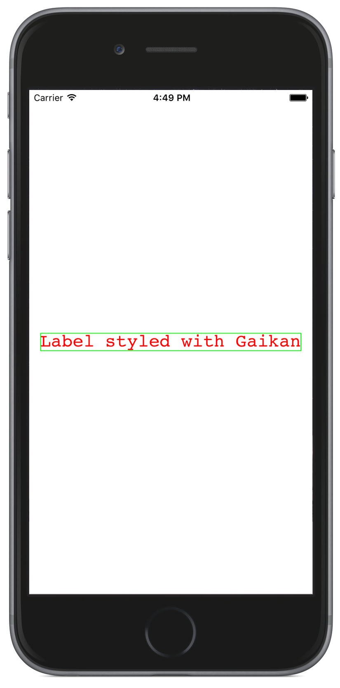

# Gaikan
[](https://travis-ci.org/akane/Gaikan)

```ruby
pod install Gaikan
```

Gaikan is a tool to style your views easily outside of your classes. It gives you powerful styling capabilities without CSS.

_Inspired by_ <a href="https://speakerdeck.com/vjeux/react-css-in-js">React: CSS in JS</a> and <a href="http://glenmaddern.com/articles/css-modules">CSS modules</a>



## Features

* Apply a simple ```StyleRule``` struct style to your views...
* ... or use ```styleName``` to apply a style from a style list
* You can reuse styles using ```extends``` method
* You can style depending on your control state (enabled, highlighted, ...)

## Usage

Check out the sample to see how Gaikan integrates inside a project.

### Basic
You can style UIView(s) by giving them a ```Style``` object:

```Swift

let myLabelStyle: Style = [
  .Color: UIColor.redColor(),
  .Border: Border(width: 1, color: UIColor.greenColor()),
  .Font: UIFont(name: "Courier", size: 24),        
]
/// OR
let myLabelStyle = StyleRule() { (inout style: StyleRule) -> () in
  style.color = UIColor.redColor()
  style.border = Border(width: 1, color: UIColor.greenColor())
  style.font = UIFont(name: "Courier", size: 24)
}

self.label.applyStyle(myLabelStyle)

```

### Theme

Manually defining a ```Style``` object for each view is pain and not maintainable.
Most of the time what you'll really want to do is defining a ```Theme``` instead: a
```Theme``` object is just a way to put multiple ```Style``` definition as a whole which
make sense.

```Swift
class CustomView: UIView, Themable {
  typealias ThemeType = RailTheme

  @IBOutlet weak var title: UILabel!
  @IBOutlet weak var footnote: UILabel!
  @IBOutlet weak var logo: UIImageView!
  @IBOutlet weak var button: UIButton!

  func stylableThemeItems() -> [Stylable] {
    return [self, self.title, self.footnote, self.logo, self.button]
  }

  override func awakeFromNib() {
    self.title.styleName = "title"
    self.logo.styleName = "home-logo"
  }
}

public class RailTheme : Theme {
    public func styles() -> [String : Style] {
        return [
            "home-logo": Style(...),
            "title": Style(...)
        ]
    }
}

```

### Extends

You can extends your styles to reuse common features

```Swift
func primary() -> Style {
  return [
    .Color: UIColor.greenColor()
  ]
}

func large() -> Style {
  return [
    .Font: UIFont.systemFontOfSize(18)
  ]
}

func merged() ->  {
  return Style().extends(primary(), large())
  // color: green, font: 18
}

```

### States

You can define styles for states. They'll extend from the default state :

```Swift
func style() -> Style {
  return [
    .TintColor: UIColor.whiteColor()
  ]
  .include(.Selected, attributes: [
      .TintColor: UIColor.grayColor().colorWithAlphaComponent(0.6)
  ]
}
```

Don't hesitate to take a look to the sample to better understand how it works.

## Properties

Depending on your view type (UILabel, UIScrollView, UITextField, ...) some properties may or
may not have any effect. Here are all the available style properties you can use:

| Property name | Apply to  | Description                     | Available version
| --------------|-----------|---------------------------------|------------------
| Background    | UIView    | Sets a background to your view  
|               |           | (color, gradient and or image)  | 0.3
| Border        | UIView    | Sets the layer Border           | 0.1
| Color         | UILabel   | Sets the text color             | 0.1
| Font          | UILabel   | Sets the text font              | 0.1
| TextAlign     | UILabel   | Text horizontal alignment       | 0.2
| TintColor     | UIView    | Sets the tint color             | 0.1
| Visible       | UIView    | Sets the view hidden property   | 0.1

## Contributing

This project was first developed by [Xebia](http://xebia.fr) and has been open source since.
We will continue working and investing on it.

We encourage the community to contribute to the project by opening tickets and/or pull requests.

## License

Gaikan is released under the MIT License. Please see the LICENSE file for details.
