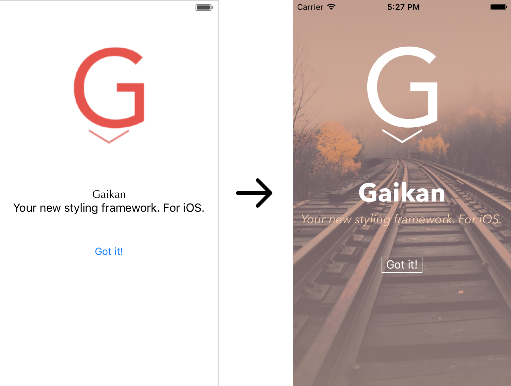
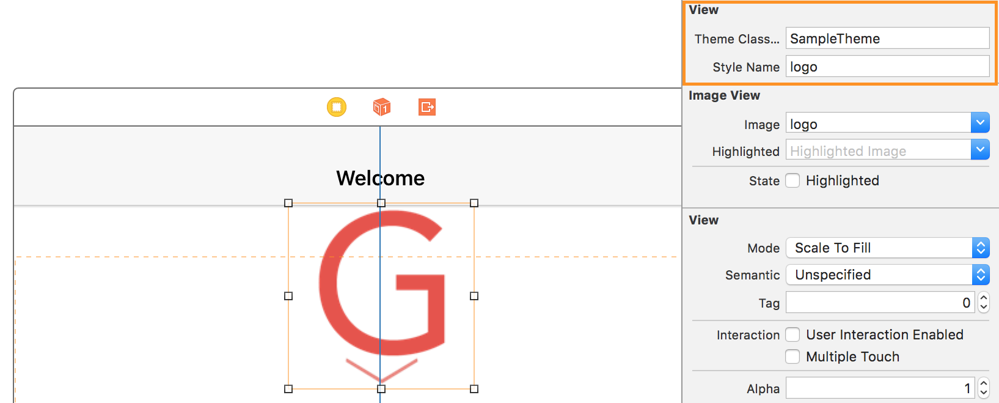

<h1></h1>

[](https://img.shields.io/cocoapods/v/Gaikan.svg)
[](https://github.com/Carthage/Carthage)
[](https://travis-ci.org/akane/Gaikan)

Gaikan gives you powerful styling capabilities using a declarative DSL in Swift.
_Inspired by_ <a href="https://speakerdeck.com/vjeux/react-css-in-js">React: CSS in JS</a> and <a href="http://glenmaddern.com/articles/css-modules">CSS modules</a>.

To style UIView(s) just give them a ```StyleRule``` object:

```Swift

let myLabelStyle = StyleRule() { (inout style: StyleRule) -> () in
  style.color = UIColor.redColor()
  style.border = Border(width: 1, color: UIColor.greenColor())
  style.font = UIFont(name: "Courier", size: 24)
}

self.label.styleInline = myLabelStyle

```

Check out the sample to see how to well integrate Gaikan into a project.



## Features

* Apply a simple style using ```styleInline```....
* ... or make theming using ```styleClass``` (see below for more information).
* You can share styles using ```extends``` method to avoid repeating yourself.
* You can style depending on your control state (enabled, highlighted, ...).
* You can style `NSAttributedString`!

## Properties

Check out our page on [properties](Doc/Properties.md) to find which one to use to style your views.

Starting with 0.4, we also added `VirtualView`. This allow you to apply style effects on some non `UIView`
attributes/objects:

| NSObject          | Virtual view  | Description            | Available since
| ------------------|---------------|------------------------|------------------
| UINavigationBar   | titleStyle    | Sets title navigation bar style   | 0.4

## Advanced usage

### NSAttributedString

Just call `NSAttributedString(string:"Hello", style: yourStyle)` to get a  styled `NSAttributedString`.

Alternatively you can use `style.textAttributes` to transform `StyleRule` into any `NSAttributedString` compatible dictionary.

### Theme

```Theme``` packages together multiple ```Style``` definitions to make a whole set.

```Swift

public class SampleTheme : Theme {
  /// Non static is important if you want to reference them from InterfaceBuilder
  lazy let logo = Style(...)
  lazy let title = Style(...)
}

class CustomView: UIView {
  typealias ThemeType = RailTheme

  @IBOutlet weak var title: UILabel!
  @IBOutlet weak var footnote: UILabel!
  @IBOutlet weak var logo: UIImageView!
  @IBOutlet weak var button: UIButton!

  override func awakeFromNib() {
    self.title.styleClass = SampleTheme().logo
    self.logo.styleClass = SampleTheme().title
  }
}

```

You can also apply themes right from InterfaceBuilder:



### Extends

You can extend your styles to reuse common features:

```Swift
func primary() -> Style {
  return [
    .Color: UIColor.greenColor()
  ]
}

func large() -> Style {
  return [
    .Font: UIFont.systemFontOfSize(18)
  ]
}

func merged() -> Style {
  return Style().extends(primary(), large())
  // color: green, font: 18
}

```

### States

You can define styles for states. They'll extend from the default state :

```Swift
func style() -> Style {
  return Style() { (inout style: StyleRule) -> Void in
    style.tintColor = UIColor.whiteColor()
  }
  .state(.Selected, attributes: [
      .TintColor: UIColor.grayColor().colorWithAlphaComponent(0.6)
  ]
}
```

Don't hesitate to take a look at the sample to better understand how it works.

## Contributing

This project was first developed by [Xebia IT Architects](http://xebia.fr) in Paris, France. We will continue working and investing on it.

We encourage the community to contribute to the project by opening tickets and/or pull requests. Here a some of the subjects we are interested in:

- Add UIStackView attributes (distribution, spacing, ...).
- Support for multiple layout engines (AutoLayout, LayoutKit, Flexbox, ...)
- Allow to define 1+ borders and corner radius. Currently defining border and radius set the 4 of them (top, bottom, left, right).
- Better support for IBDesignable (if possible).
- Add debugging information (style name, inheritance, ...).
- Better integration with NSAttributedString.
- Support for traits.
- Anything you have in mind!

## License

Gaikan is released under the MIT License. Please see the LICENSE file for details.
